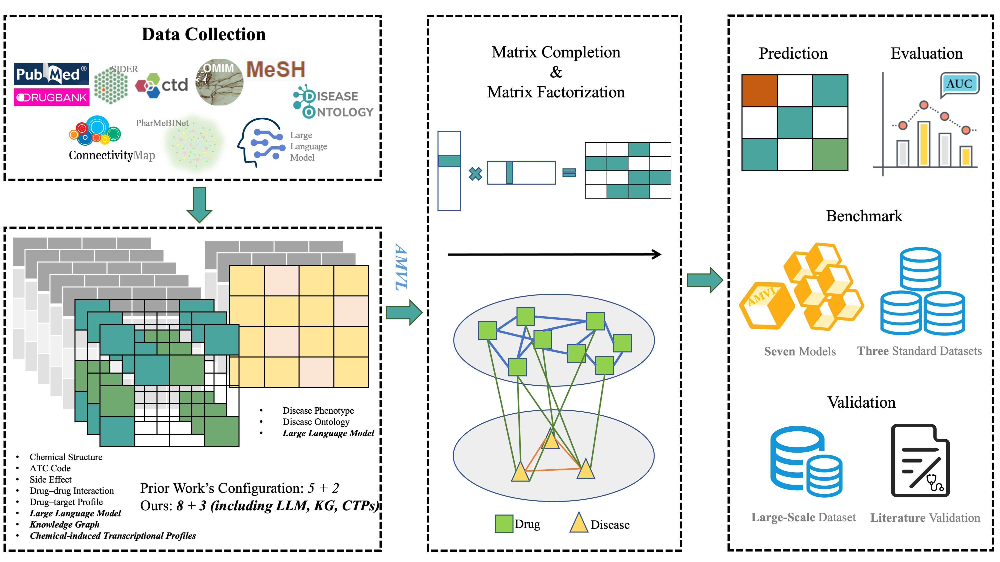

# AMVL: A Multi-View Learning Method for Enhanced Drug Repurposing Using CTPs, Knowledge Graph, and LLM

This repository contains the code, datasets, and resources for the project **AMVL**, which integrates multi-view learning approaches with transcriptomic profiles, knowledge graphs, and large language models to improve drug repositioning predictions.



## Project Structure

### `data/`

[download link](https://doi.org/10.5281/zenodo.14726287)

- **Benchmark**: Contains benchmark Excel files from previous studies, which include data on heterogeneous networks for various drug repositioning algorithms.
- **Fdataset, Cdataset, Ydataset**: Three evaluation datasets.
  - **Fdataset**: Gold-standard dataset for evaluation.
  - **Cdataset and Ydataset**: Standard datasets for evaluation.
  - Each dataset includes:
    - Raw files for knowledge graph representations and large language model (LLM) representations.
    - Integrated MATLAB files containing:
      - 8 drug similarity matrices.
      - 3 disease similarity matrices.
- **other**: Contains files with IDs for all drugs and diseases.

### `function/`
Contains the code for all methods discussed in this work, as well as code for comparison methods. This includes implementations of multi-view learning algorithms and models for drug repositioning.

### `notebook/`
Jupyter notebooks that provide:
- Evaluation framework and workflows.
- Code to compute similarity matrices from representations.
- Subset extraction of representations for each dataset.
- Processing steps and methods for obtaining knowledge graph representations and large language model representations.

### `utils/`
Utility scripts, including:
- Evaluation workflow code.
- Scripts for various evaluation metrics.
- Additional helper functions required for processing and evaluation.

### `img/`
Stores images related to the project, which may be used for documentation or visual explanations of the project’s methodologies and results.

---

## Getting Started

### Prerequisites

Ensure that you have the following libraries and dependencies installed:
- Python 3.x
- `requests`, `beautifulsoup4`, and other necessary packages listed in `requirements.txt` (if available).

### Installation

Clone this repository and navigate to the project directory:
```bash
git clone https://github.com/yourusername/AdaMVL.git
cd AdaMVL
```

Install the required packages:
```bash
pip install -r requirements.txt
```

### Usage

1. **Data Preparation**: Ensure that the datasets in `data/` are correctly structured, with the benchmark and evaluation datasets properly organized.
2. **Method Implementation**: The `function/` directory includes all necessary implementations for running multi-view learning models.
3. **Evaluation and Analysis**: Use the Jupyter notebooks in the `notebook/` directory to conduct evaluation workflows, similarity calculations, and representation extraction.
4. **Utilities**: The `utils/` directory contains helper scripts for metrics and processing, which are used in the notebooks and main methods.

### Running the Notebooks
Open the notebooks in `notebook/` to explore the evaluation process and follow along with representation calculations, similarity extraction, and other analyses:
```bash
jupyter notebook
```

